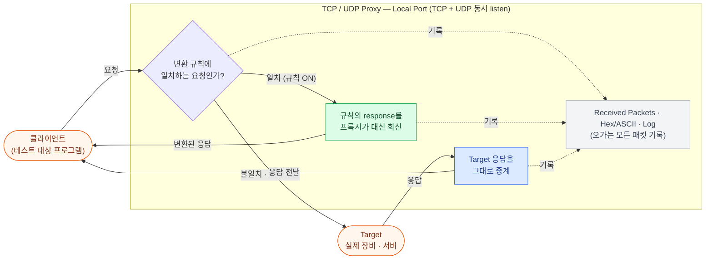
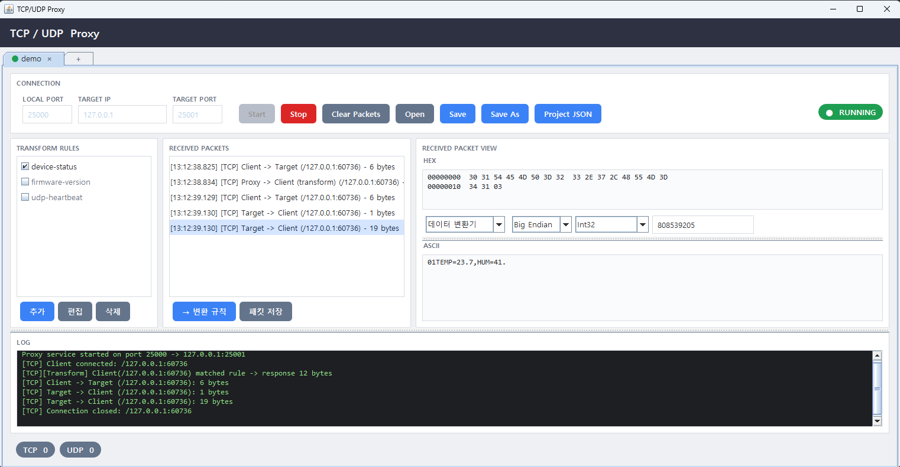
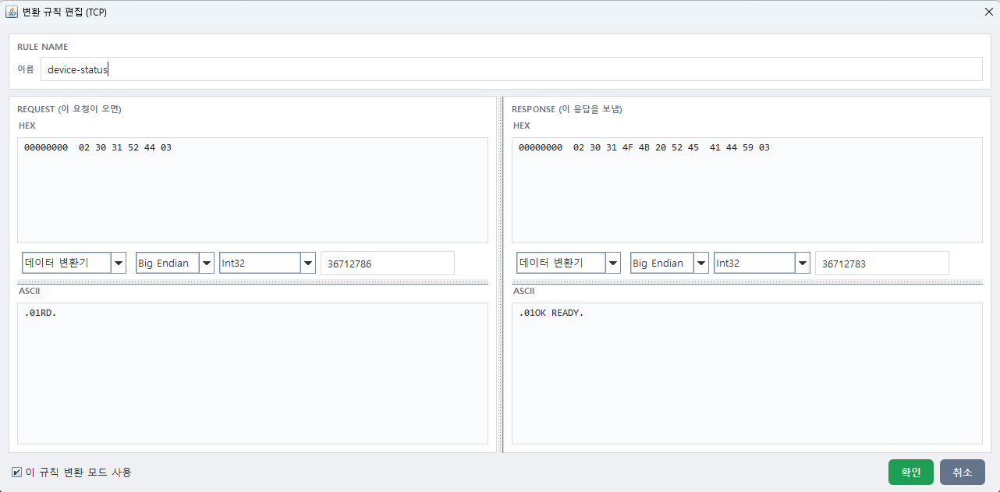
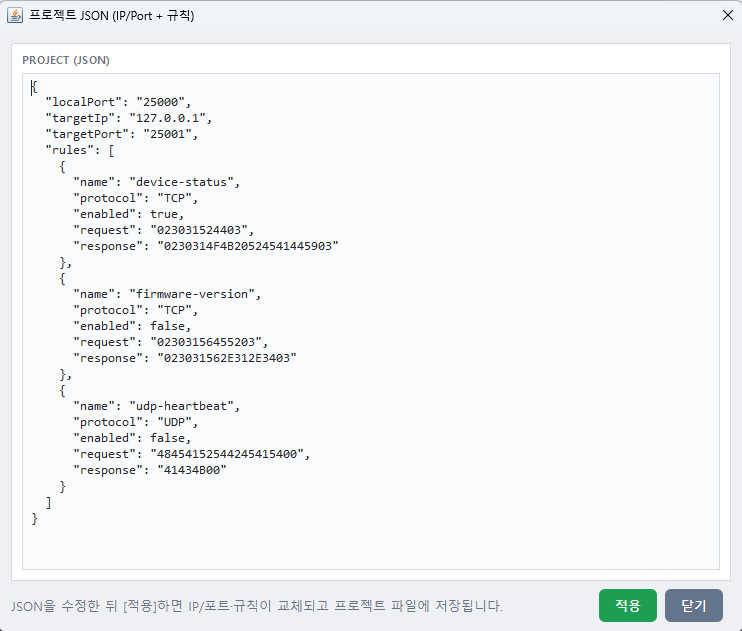

# TCP / UDP Proxy

장비·서버 사이의 TCP/UDP 트래픽을 중계하면서 **주고받는 패킷을 눈으로 확인**하고,
특정 요청에 대해 **원하는 응답을 대신 돌려주는(변환된 응답, transform)** Swing 데스크톱 도구입니다.

실장비 없이 장비 프로토콜을 테스트하거나, 현장 장비의 응답을 재현해 클라이언트를 검증할 때 사용합니다.

### 동작 구성도



클라이언트는 Target 대신 **프록시의 Local Port** 로 접속합니다.
프록시는 들어온 요청이 켜져 있는 변환 규칙과 완전히 일치하면 Target으로 보내지 않고 규칙의 응답을 즉시 돌려주고,
일치하지 않으면 그대로 Target에 전달한 뒤 그 응답을 클라이언트로 중계합니다. 어느 경로든 오가는 패킷은 모두 기록됩니다.



---

## 목차

1. [주요 기능](#주요-기능)
2. [설치와 실행](#설치와-실행)
3. [화면 구성](#화면-구성)
4. [기본 사용법](#기본-사용법)
5. [변환 규칙 사용하기](#변환-규칙-사용하기)
6. [프로젝트 저장 · 열기 · 탭](#프로젝트-저장--열기--탭)
7. [프로젝트 JSON 직접 편집](#프로젝트-json-직접-편집)
8. [패킷 저장](#패킷-저장)
9. [파일이 저장되는 위치](#파일이-저장되는-위치)
10. [알아두면 좋은 동작](#알아두면-좋은-동작)
11. [빌드 · 배포](#빌드--배포)
12. [문제 해결](#문제-해결)

---

## 주요 기능

| 기능 | 설명 |
| --- | --- |
| TCP/UDP 동시 중계 | 하나의 Local Port에서 TCP와 UDP를 동시에 listen 하여 Target으로 전달 |
| 패킷 모니터링 | 오가는 모든 패킷을 시각·방향·크기와 함께 목록으로 표시, Hex/ASCII 로 확인 |
| 변환 규칙 | 지정한 요청이 들어오면 Target으로 보내지 않고 미리 정해둔 응답을 즉시 회신 |
| 패킷 → 규칙 자동 생성 | 실제로 캡처한 요청/응답 한 쌍을 그대로 규칙으로 변환 |
| 데이터 변환기 | Hex 뷰에서 커서 위치의 바이트를 Int8~Int64/float/double 로 해석 (Big/Little Endian) |
| CheckSum 계산기 | Hex 뷰에서 선택한 범위의 Modular Sum / XOR 체크섬 계산 |
| 프로젝트 | IP·포트·규칙 묶음을 이름 붙여 저장, 탭으로 여러 프록시를 동시에 실행 |
| JSON 편집 | 프로젝트 전체를 JSON 텍스트로 보고 편집·붙여넣기 |

---

## 설치와 실행

### 방법 1. 배포용 실행 파일 (권장, Java 설치 불필요)

`TcpUdpProxy-1.0-win-x64.zip` 을 원하는 폴더에 풀고 `TcpUdpProxy.exe` 를 실행합니다.
Java 런타임이 함께 포함되어 있어 별도 설치가 필요 없습니다.

### 방법 2. JAR 직접 실행 (JDK 17 이상 필요)

```bash
mvn clean package
java -jar target/tcp-udp-proxy-1.0-SNAPSHOT-jar-with-dependencies.jar
```

> Windows PowerShell에서 Maven이 다른 JDK를 잡는 경우 `$env:JAVA_HOME = "C:\Program Files\Java\jdk-21"` 를 먼저 설정하세요.

---

## 화면 구성

| 영역 | 설명 |
| --- | --- |
| **탭 바** | 프로젝트 하나당 탭 하나. `●` 표시가 초록이면 그 탭의 프록시가 실행 중이며, `+` 를 누르면 새 탭이 열립니다. |
| **Connection** | Local Port / Target IP / Target Port 와 Start·Stop·저장 관련 버튼. 오른쪽 `RUNNING`/`STOPPED` 배지로 상태 표시. |
| **Transform Rules** | 변환 규칙 목록. 체크박스로 개별 on/off, 더블클릭으로 편집. |
| **Received Packets** | 수신·송신된 패킷 목록 (최대 2,000개, 넘으면 오래된 것부터 삭제). |
| **Received Packet View** | 선택한 패킷의 Hex / ASCII 내용 (읽기 전용) 과 데이터 변환기·체크섬 계산기. |
| **Log** | 연결, 전달 바이트 수, 규칙 매칭 등의 실행 로그. |
| **하단 상태바** | 현재 살아있는 TCP 연결 수와 UDP 세션 수. |

---

## 기본 사용법

1. **Local Port** 에 클라이언트가 접속할 포트를 입력합니다. (예: `25000`)
2. **Target IP / Target Port** 에 실제 장비·서버 주소를 입력합니다. (예: `127.0.0.1` / `25001`)
3. **Start** 를 누릅니다. 배지가 `RUNNING` 으로 바뀌고 포트 입력란이 잠깁니다.
4. 클라이언트를 **Target 대신 프록시(Local Port)** 로 접속시킵니다.
5. 오가는 패킷이 **Received Packets** 에 쌓입니다. 목록에서 항목을 고르면 오른쪽에 Hex/ASCII 가 표시됩니다.
6. **Stop** 을 누르면 열려 있던 모든 소켓을 닫고 중지합니다.

패킷 목록의 방향 표기는 다음과 같습니다.

| 표기 | 의미 |
| --- | --- |
| `Client -> Target` | 클라이언트가 보낸 요청 |
| `Target -> Client` | 실제 장비/서버가 보낸 응답 |
| `Proxy -> Client (transform)` | 변환 규칙이 가로채서 프록시가 대신 보낸 응답 |

### 데이터 변환기 / 체크섬 계산기

Hex 뷰 아래 콤보 박스로 두 도구를 전환합니다.

- **데이터 변환기** — Hex 뷰에서 바이트를 클릭하면, 그 위치부터의 값을 선택한 타입(Int8 ~ UInt64, float32, float64, 2진수)과 Endian 으로 해석해 보여줍니다.
- **CheckSum 계산기** — Hex 뷰에서 범위를 드래그 선택하면 그 구간의 Modular Sum 또는 XOR 체크섬을 1바이트 Hex 로 계산하고, 옆에 계산에 쓰인 바이트 수를 표시합니다.

---

## 변환 규칙 사용하기

변환 규칙은 **"이 요청이 오면 Target에 전달하지 말고, 이 응답을 대신 보내라"** 는 규칙입니다.

### 방법 A. 캡처한 패킷으로 규칙 만들기 (가장 쉬움)

1. 프록시를 실행해 실제 통신을 한 번 흘려보냅니다.
2. **Received Packets** 에서 재현하고 싶은 **응답 패킷**(`Target -> Client`)을 선택합니다.
3. **→ 변환 규칙** 버튼을 누릅니다.
   - 그 응답 바로 앞의 같은 프로토콜·같은 상대의 요청(`Client -> Target`)이 자동으로 `request` 에 채워집니다.
   - 선택한 응답이 `response` 가 됩니다.
4. 편집 창이 열리면 이름을 정하고 **확인** 을 누릅니다.

> **→ 변환 규칙** 버튼은 응답 패킷을 선택했을 때만 활성화됩니다.

### 방법 B. 직접 추가하기

1. **Transform Rules** 의 **추가** 버튼을 누르고 TCP / UDP 를 고릅니다.
2. 편집 창에서 Request / Response 를 입력합니다.



편집 창에서는 Hex 와 ASCII 를 모두 편집할 수 있고, 둘은 서로 동기화됩니다.

- Hex 는 `02 30 31 03` 처럼 띄어쓰기 있게 입력해도 되고, `02303103` 처럼 붙여 써도 됩니다.
- 하단 **이 규칙 변환 모드 사용** 체크박스로 규칙을 켜고 끕니다. 목록에서 체크박스를 직접 눌러도 됩니다.

### 규칙이 적용되는 방식

- **정확히 일치**할 때만 적용됩니다. 수신한 바이트 배열 전체가 규칙의 `request` 와 완전히 같아야 합니다. (부분 일치·와일드카드 없음)
- **프로토콜이 같아야** 합니다. TCP 규칙은 TCP 요청에만, UDP 규칙은 UDP 요청에만 적용됩니다.
- 조건을 만족하는 규칙이 여러 개면 **목록에서 위에 있는 규칙**이 적용됩니다.
- 체크가 해제된 규칙은 무시되고, 그 요청은 평소대로 Target 으로 전달됩니다.
- 규칙을 추가·수정·삭제하거나 체크 상태를 바꾸면 **프로젝트 파일에 즉시 자동 저장**됩니다. (이름이 정해진 프로젝트인 경우)

---

## 프로젝트 저장 · 열기 · 탭

하나의 **프로젝트** = Local Port + Target IP + Target Port + 변환 규칙 전체.

| 버튼 | 동작 |
| --- | --- |
| **Save** | 현재 프로젝트 파일에 저장. 아직 이름이 없으면 Save As 로 이어집니다. |
| **Save As** | 이름을 입력해 새 프로젝트로 저장. 같은 이름이 있으면 덮어쓸지 물어봅니다. |
| **Open** | 저장된 프로젝트 목록에서 골라 현재 탭에 불러옵니다. 이미 다른 탭에 열려 있으면 그 탭으로 이동합니다. |

- 탭마다 **독립된 프록시**가 돌아갑니다. 서로 다른 포트라면 여러 프록시를 동시에 실행할 수 있습니다.
- 탭의 `×` 로 닫을 수 있고, 실행 중이면 중지할지 확인합니다.
- 열려 있던 프로젝트 탭들은 기록되어 **다음 실행 시 그대로 복원**됩니다.

---

## 프로젝트 JSON 직접 편집

**Project JSON** 버튼을 누르면 프로젝트 전체를 JSON 으로 보고 편집할 수 있습니다.
규칙을 대량으로 만들거나, 다른 사람에게 설정을 통째로 전달할 때 편리합니다.



```json
{
  "localPort": "25000",
  "targetIp": "127.0.0.1",
  "targetPort": "25001",
  "rules": [
    {
      "name": "device-status",
      "protocol": "TCP",
      "enabled": true,
      "request": "023031524403",
      "response": "0230314F4B20524541445903"
    }
  ]
}
```

- `request` / `response` 는 **Hex 문자열**입니다. 공백은 무시되므로 `02 30 31` 처럼 써도 됩니다.
- `protocol` 은 `"TCP"` 또는 `"UDP"` 만 허용됩니다.
- **적용** 을 누르면 IP·포트·규칙이 모두 교체되고 프로젝트 파일에 저장됩니다.
- 규칙 배열(`[ ... ]`)만 붙여넣어도 인식합니다. 이 경우 IP·포트는 기존 값이 유지됩니다.

---

## 패킷 저장

**패킷 저장** 버튼을 누르면 현재 목록의 모든 패킷을 텍스트 파일로 저장합니다.
파일명은 `captures/packets_20260922_131238.txt` 형식이며, 각 패킷의 헤더·Hex 덤프·ASCII 가 함께 기록됩니다.

**Clear Packets** 는 목록과 Hex 뷰를 비웁니다. (규칙과 설정에는 영향이 없습니다.)

---

## 파일이 저장되는 위치

모든 파일은 **실행 파일(또는 jar)이 있는 폴더** 기준으로 만들어집니다.

```
TcpUdpProxy.exe
├─ projects/
│   ├─ default.json        프로젝트 파일 (프로젝트 이름 = 파일 이름)
│   └─ my-device.json
├─ captures/
│   └─ packets_YYYYMMDD_HHmmss.txt
├─ .open-projects          마지막에 열려 있던 탭 목록
└─ .current-project        (구버전 호환용)
```

구버전의 `proxy-config.properties` 파일이 있으면 첫 실행 시 자동으로 JSON 프로젝트로 변환합니다.

---

## 알아두면 좋은 동작

- **Target 에 접속할 수 없어도 프록시는 동작합니다.** 이 경우 로그에 `intercept-only mode` 가 찍히고, 변환 규칙에 맞는 요청만 응답을 받습니다. 규칙에 맞지 않는 요청은 버려집니다. 실장비 없이 규칙만으로 시뮬레이션할 때 유용합니다.
- **TCP 는 스트림입니다.** 규칙 매칭은 한 번의 `read()` 로 읽어온 덩어리 전체를 기준으로 하므로, 클라이언트가 한 프레임을 나눠 보내거나 여러 프레임을 붙여 보내면 규칙이 일치하지 않을 수 있습니다.
- **UDP 세션은 60초** 동안 트래픽이 없으면 자동 정리됩니다.
- **Local Port 는 TCP·UDP 양쪽에서 열립니다.** 둘 중 하나라도 이미 사용 중이면 시작에 실패하며 로그에 사유가 남습니다.
- 패킷 목록은 **2,000개**를 넘으면 가장 오래된 것부터 지워집니다.

---

## 빌드 · 배포

### 테스트

```bash
mvn test
```

`ProxyTest`(TCP/UDP 에코 중계), `TransformProxyTest`(규칙 매칭·프로토콜 분리·비활성 규칙),
`ProxyStopTest`(중지 시 소켓 해제), `PacketHexTest`, `PacketDirectionTest` 가 실행됩니다.

### 배포용 exe 만들기

```powershell
powershell -ExecutionPolicy Bypass -File build-exe.ps1
```

`build-exe.ps1` 이 Maven 패키징 → `jlink` 로 축소 런타임 생성 → `jpackage` 로 실행 이미지 생성까지 수행합니다.
결과물은 다음과 같습니다.

- `dist/TcpUdpProxy/TcpUdpProxy.exe` — 실행 파일
- `dist/TcpUdpProxy-1.0-win-x64.zip` — 배포용 압축본

> 스크립트 상단의 `$JdkHome` 경로(기본 `C:\Program Files\Java\jdk-21`)에 JDK 21 이 설치되어 있어야 합니다.

### 소스 구조

| 파일 | 역할 |
| --- | --- |
| `ProxyApp` | 메인 창, 탭 관리 |
| `ProxyPanel` | 탭 하나 = 프로젝트 하나의 전체 UI와 동작 |
| `ProxyService` | TCP/UDP 중계와 변환 규칙 적용 (네트워크 코어) |
| `TransformRule` / `TransformRuleDialog` | 변환 규칙 모델과 편집 창 |
| `ProxyConfig` / `ProjectStore` / `Json` / `TransformJson` | 프로젝트 직렬화와 파일 저장 |
| `HexEditor` / `HexUtilPanel` / `PacketHex` | Hex·ASCII 편집기, 데이터 변환기·체크섬 |
| `PacketInfo` | 캡처된 패킷 한 건 |
| `UiTheme` / `FlatButton` | 공통 스타일 |

---

## 문제 해결

| 증상 | 확인할 것 |
| --- | --- |
| Start 직후 로그에 `Address already in use` | 다른 프로그램이나 다른 탭이 같은 Local Port 를 쓰고 있습니다. |
| `Error: Invalid port number.` | 포트 입력란에 숫자가 아닌 값이 들어 있습니다. |
| 로그에 `Target unreachable, intercept-only mode` | Target IP/Port 로 접속할 수 없습니다. 주소·방화벽을 확인하세요. 규칙만 테스트하는 중이라면 정상입니다. |
| 규칙을 켰는데 적용되지 않음 | ① 프로토콜(TCP/UDP)이 맞는지 ② 요청 바이트가 **완전히 동일**한지 ③ 규칙 체크박스가 켜져 있는지 확인하세요. 캡처한 `Client -> Target` 패킷의 Hex 와 규칙의 Request 를 직접 비교하면 빠릅니다. |
| 설정이 저장되지 않음 | 한 번도 저장하지 않은 `(새 프로젝트)` 탭은 자동 저장되지 않습니다. **Save As** 로 이름을 지정하세요. |
